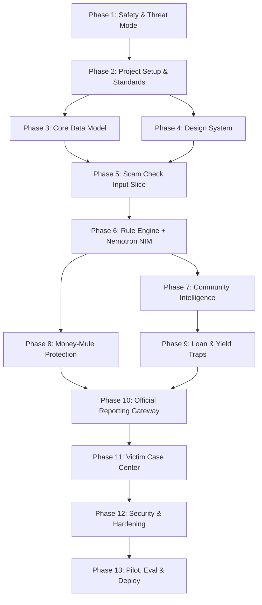

# Scamfy — Phase Roadmap & Execution Schedule

This roadmap organizes Scamfy's development across 6 milestones and 13 vertical phases.

---

## Milestone Summary

- **Milestone 0: Foundation (Phases 1–4)** — Architecture, safety contract, data models, design tokens.
- **Milestone 1: Slice 1 - Core Scam Check (Phases 5–6)** — Text input, entity extraction, deterministic rules, Nemotron NIM analysis, explainable UI.
- **Milestone 2: Slice 2 - Community Intel & Mule Shield (Phases 7–8)** — Indicator database, moderation pipeline, money-mule detection & transfer warnings.
- **Milestone 3: Slice 3 - Financial Traps & Official Gateway (Phases 9–10)** — Predatory loan & yield calculator, 1930 / cybercrime.gov.in official reporting gateway.
- **Milestone 4: Slice 4 - Victim Support (Phase 11)** — Victim Case Center, evidence timeline, secure document storage.
- **Milestone 5: Production & Pilot (Phases 12–13)** — Security audit, rate limiting, abuse mitigation, pilot dataset evaluation, deployment.

---

## Detailed Phase Breakdown

---

### Phase 1: Product Definition, Safety Boundaries & Threat Model
- **Goal**: Establish safety rules, non-goals, scam taxonomy, user roles, abuse models, and legal trust boundaries.
- **Deliverables**: `.planning/phases/01-safety-and-threat-model/PLAN.md`, safety specifications, scam category taxonomy.
- **Requirements**: `SEC-01`, `SEC-02`, `SEC-04`, `ENG-05`, `OOS-01..06`.
- **Status**: Ready to Plan / Execute.

### Phase 2: Project Structure, GSD Workflow & Standards
- **Goal**: Establish the Next.js + FastAPI repository workspace, linting, formatting, environment isolation, testing harnesses, and Definition of Done.
- **Deliverables**: Unified directory layout, backend/frontend build configs, test runners, git hooks.
- **Requirements**: `ENG-04`, `ENG-05`.
- **Status**: Planned.

### Phase 3: Core Data Model & Migrations
- **Goal**: Define PostgreSQL relational models (Users, Checks, Signals, Patterns, Reports, Cases, Evidence, Audits) via SQLAlchemy and Alembic.
- **Deliverables**: SQLAlchemy ORM models, migration scripts, test fixtures, relational boundary validation.
- **Requirements**: `SEC-06`, `SEC-07`.
- **Status**: Planned.

### Phase 4: Design System & Interaction Direction
- **Goal**: Build calm, accessible, trustworthy UI foundations with Tailwind CSS and shadcn/ui.
- **Deliverables**: Semantic color tokens, typography scales, risk status badges, alert banners, accessible interactive primitives.
- **Requirements**: `UX-03`, `UX-04`, `UX-05`.
- **Status**: Planned.

### Phase 5: Scam Check Input & Analysis Slice (Slice 1)
- **Goal**: Build the first end-to-end working vertical slice: text input form, entity extraction parser, analysis API endpoint, and structured results view.
- **Deliverables**: Input UI, FastAPI analyze endpoint, entity highlighting, initial result cards.
- **Requirements**: `DET-01`, `DET-03`, `DET-04`, `UX-01`.
- **Status**: Planned.

### Phase 6: Deterministic Risk Engine + NVIDIA Nemotron Analysis
- **Goal**: Combine rule-based red flag detection with server-side NVIDIA Nemotron inference through NVIDIA NIM with typed Pydantic validation.
- **Deliverables**: Rule evaluator, Nemotron client, schema validator, fallback error recovery, benchmark evaluation suite.
- **Requirements**: `DET-02`, `DET-05`, `AI-01..05`, `ENG-01`, `ENG-02`.
- **Status**: Planned.

### Phase 7: Scam Pattern Database & Community Reporting (Slice 2)
- **Goal**: Enable authenticated users to submit scam indicators, deduplicate patterns, and establish moderator review workflows.
- **Deliverables**: Report submission modal, indicator indexing, deduplication engine, moderation dashboard, public intelligence view.
- **Requirements**: `REP-01..05`.
- **Status**: Planned.

### Phase 8: Money-Mule Protection & Transfer Warnings
- **Goal**: Detect mule recruitment patterns (forwarding funds, task commissions), trigger pre-transfer warnings, and guide already-transferred fund situations.
- **Deliverables**: Mule indicator rules, warning modal UX, emergency guidance flow, case handoff.
- **Requirements**: `MULE-01..03`, `UX-02`.
- **Status**: Planned.

### Phase 9: Loan & High-Return Trap Analyzer (Slice 3)
- **Goal**: Provide transparent calculations for predatory digital loans (disbursement vs repayment vs APR) and implausible investment returns.
- **Deliverables**: Loan calculator UI, financial anomaly rules, lender verification checklists, Nemotron contextual summaries.
- **Requirements**: `LOAN-01..03`.
- **Status**: Planned.

### Phase 10: Official Reporting Gateway
- **Goal**: Source-backed directory and guided reporting workflow for Indian Cyber Crime (1930 / cybercrime.gov.in) with explicit user payload authorization.
- **Deliverables**: Route resolver, complaint payload builder, authorization review step, deep link generator, case reference tracker.
- **Requirements**: `OFF-01..06`.
- **Status**: Planned.

### Phase 11: Victim Case Center & Evidence Vault (Slice 4)
- **Goal**: Provide victims with a centralized private dashboard to organize chronological timelines, receipts, transaction IDs, and generate factual incident summaries.
- **Deliverables**: Case dashboard, timeline manager, R2/S3 signed URL upload pipeline, incident export generator.
- **Requirements**: `CASE-01..06`.
- **Status**: Planned.

### Phase 12: Production Security, Privacy & Hardening
- **Goal**: Comprehensive security hardening: rate limiting, audit logging, input sanitization, prompt injection defense, private evidence access controls.
- **Deliverables**: SlowAPI rate limiting, audit trails, security test suite, error masking, Playwright E2E security suite.
- **Requirements**: `SEC-03`, `SEC-05`, `SEC-06`, `SEC-07`, `ENG-03`.
- **Status**: Planned.

### Phase 13: Pilot Evaluation, Benchmarks & Release
- **Goal**: Benchmark evaluation across diverse scam/benign test cases, verify precision/recall, configure privacy-safe analytics, and deploy to Vercel/Railway.
- **Deliverables**: Evaluation benchmark report, Sentry/PostHog integration, production deployment verification.
- **Requirements**: `ENG-04`.
- **Status**: Planned.
