# Phase 3: Core Data Model & Migrations — Research

## 1. Relational Architecture & Entity-Relationship Schema (Prisma on PostgreSQL)

Per **ADR 0001**, Scamfy uses **Prisma ORM** as the single database schema and migration authority, owned by the Next.js TypeScript BFF application layer. The PostgreSQL database enforces strict relational integrity, UUID primary keys, JSON/JSONB fields for variable structures, explicit foreign key cascading, and append-only audit protections.

```mermaid
erDiagram
    USERS ||--o{ SCAM_CHECKS : "initiates (optional FK)"
    USERS ||--o{ COMMUNITY_REPORTS : "submits (reporterUserId)"
    USERS ||--o{ VICTIM_CASES : "owns (userId)"
    USERS ||--o{ CASE_SUPPORT_GRANTS : "grantedBy / grantee"
    
    SCAM_PATTERNS ||--o{ COMMUNITY_REPORTS : "aggregates (patternId)"
    
    VICTIM_CASES ||--o{ CASE_TIMELINE_EVENTS : "contains (caseId)"
    VICTIM_CASES ||--o{ CASE_EVIDENCE : "attaches (caseId)"
    VICTIM_CASES ||--o{ CASE_SUPPORT_GRANTS : "authorizes (caseId)"

    USERS {
        uuid id PK "Internal Scamfy UUID"
        string clerkUserId UK "External Clerk Subject (Indexed)"
        string email "Nullable"
        string role "student_user | college_admin | moderator"
        string collegeDomain "Nullable"
        datetime createdAt
        datetime updatedAt
    }

    SCAM_CHECKS {
        uuid id PK
        uuid userId FK "Nullable for anonymous analysis"
        string inputHash "SHA-256 preview"
        string overallRisk "SAFE | CAUTION | SUSPICIOUS | HIGH_RISK | CRITICAL"
        string primaryCategory "Taxonomy category"
        jsonb secondaryCategories "JSONB array of secondary categories"
        jsonb signals "JSONB list of detected red-flag rules"
        jsonb extractedEntities "JSONB dict of extracted identifiers"
        jsonb modelMetadata "JSONB inference telemetry (model, prompt version)"
        jsonb actionRecommendations "JSONB list of approved advice"
        datetime createdAt
    }

    SCAM_PATTERNS {
        uuid id PK
        string indicatorType "UPI_ID | PHONE | DOMAIN | HANDLE | BANK_ACC | SCRIPT"
        string indicatorValue "Normalized string"
        string category "Taxonomy category"
        string riskLevel "LOW | MEDIUM | HIGH | CRITICAL"
        string verificationStatus "UNVERIFIED | COMMUNITY_FLAGGED | MODERATOR_VERIFIED | DISMISSED"
        int reportCount "Default 1"
        datetime firstReportedAt
        datetime lastReportedAt
        jsonb metadataPayload "Variable metadata attributes"
    }

    COMMUNITY_REPORTS {
        uuid id PK
        uuid reporterUserId FK "References users.id (Non-nullable)"
        uuid patternId FK "References scam_patterns.id (Nullable)"
        string indicatorType "UPI_ID | PHONE | DOMAIN | HANDLE | BANK_ACC | SCRIPT"
        string indicatorValue "Submitted indicator string"
        string category "Taxonomy category"
        text description "Report narrative"
        string status "PENDING | APPROVED | REJECTED | MERGED"
        text moderatorNotes "Nullable triage notes"
        datetime createdAt
        datetime updatedAt
    }

    VICTIM_CASES {
        uuid id PK
        uuid userId FK "References users.id (Non-nullable owner)"
        string title "Case title"
        string category "Taxonomy category"
        numeric financialLossAmount "Numeric(12, 2) Nullable"
        string currency "Default 'INR'"
        string status "DRAFT | OPEN | OFFICIAL_REPORTED | RESOLVED | ARCHIVED"
        string officialComplaintAckNo "1930 / Cybercrime Ack No"
        datetime createdAt
        datetime updatedAt
    }

    CASE_TIMELINE_EVENTS {
        uuid id PK
        uuid caseId FK "References victim_cases.id (CASCADE)"
        datetime eventTimestamp "Incident timestamp"
        string eventType "INITIAL_CONTACT | PAYMENT_SENT | PAYMENT_REQ | THREAT | POLICE_REPORT | NOTE"
        text description "Factual event description"
        numeric amount "Numeric(12, 2) Nullable"
        string counterpartyIdentifier "UPI/Handle/Account Nullable"
        datetime createdAt
        datetime updatedAt
    }

    CASE_EVIDENCE {
        uuid id PK
        uuid caseId FK "References victim_cases.id (CASCADE)"
        string fileKey UK "R2/S3 Object Key"
        string fileName "Sanitized original filename"
        bigint fileSizeBytes "File size in bytes"
        string contentType "Validated MIME type"
        string sha256Checksum "SHA-256 digest"
        boolean magicSignatureVerified "Magic byte confirmation"
        datetime createdAt
        datetime updatedAt
    }

    CASE_SUPPORT_GRANTS {
        uuid id PK
        uuid caseId FK "References victim_cases.id (CASCADE)"
        uuid grantedByUserId FK "References users.id (CASCADE)"
        uuid granteeUserId FK "References users.id (CASCADE)"
        datetime expiresAt "Time-bounded expiration"
        datetime revokedAt "Nullable explicit revocation timestamp"
        string rationale "Nullable grant context"
        datetime createdAt
        datetime updatedAt
    }

    AUDIT_EVENTS {
        uuid id PK
        string actorId "Clerk ID or internal UUID of actor"
        string actorRole "student_user | college_admin | moderator | system"
        string action "MODERATE_REPORT | SUPPORT_ACCESS | VERIFY_PATTERN | etc."
        string targetResourceType "community_report | victim_case | etc."
        string targetResourceId "ID of affected resource"
        jsonb details "Sanitized context metadata (no raw secrets/PII)"
        string ipAddressHash "Hashed client IP"
        datetime createdAt "Append-only timestamp"
    }
```



---

## 2. Core Architectural Principles & Boundaries

### 1. Prisma as Application Persistence Authority (ADR 0001)
- Next.js Server Components, Server Actions, and Route Handlers use `@prisma/client` directly with fully generated TypeScript types.
- FastAPI acts purely as a stateless AI inference microservice for Nemotron 70B and deterministic heuristic scoring. FastAPI does **not** connect to or modify the PostgreSQL database.

### 2. Clerk Identity Boundary
- Internal foreign keys strictly reference internal `User.id` (`@db.Uuid`).
- External Clerk identity tokens map to `User.clerkUserId` (`@unique` index).
- This decouples database relational keys from external auth provider identity formats while enabling $O(1)$ indexed lookups.

### 3. Strict Privacy Boundaries
- **`scam_checks`**: Stores private, unauthenticated/authenticated analysis records (`SEC-01`). Input hashes and extracted entities are never automatically shared or exposed to public views.
- **`community_reports`**: Explicit, authenticated community submissions (`REP-01`).
- **`scam_patterns`**: Normalized threat directory. Enforces composite uniqueness on `@@unique([indicatorType, indicatorValue])` to prevent duplicate indicator fragmentation (`REP-03`).

### 4. Structural Privacy Chain: User -> VictimCase -> Evidence
- Victim cases are strictly owned by `User` (`userId` non-nullable).
- `CaseEvidence`, `CaseTimelineEvent`, and `CaseSupportGrant` cascade delete with `VictimCase`.
- Access control traverses `evidence.case.userId === session.userId` or verifies an unrevoked, non-expired `CaseSupportGrant` record for the requesting moderator (`SEC-07`, `CASE-01..04`).

### 5. Append-Only Audit Log (`SEC-06`)
- `AuditEvent` records sensitive state transitions (moderation, access grants, verification).
- Enforced at the **PostgreSQL database boundary** via a `BEFORE UPDATE OR DELETE` trigger `trg_audit_events_prevent_mutation` generated in the migration script, raising an exception on any mutation attempt.
- Enforced at the **Prisma Client layer** via client extensions intercepting and throwing errors on `update`, `updateMany`, `delete`, or `deleteMany`.

---

## 3. Tooling, Migrations & Testing Architecture

### 1. Prisma Client Singleton in Next.js
- In Next.js App Router (Node.js runtime), avoid creating multiple client instances during hot-reloads:
  ```typescript
  import { PrismaClient } from '@prisma/client';

  const globalForPrisma = globalThis as unknown as { prisma: PrismaClient | undefined };

  export const prisma = globalForPrisma.prisma ?? new PrismaClient();

  if (process.env.NODE_ENV !== 'production') globalForPrisma.prisma = prisma;
  ```

### 2. Prisma Migrate Workflow
- `prisma migrate dev --name initial_schema`: Generates initial SQL migration including tables, indexes, unique constraints, foreign keys, and PostgreSQL trigger definitions.
- `prisma generate`: Generates TypeScript Prisma Client types and models.

### 3. Integration Testing Against Real PostgreSQL
- Tests execute with Vitest in `scamfy/lib/prisma.test.ts` or `tests/integration/prisma.test.ts` against a live PostgreSQL test database (`TEST_DATABASE_URL`).
- Verifies:
  - User creation & Clerk identity uniqueness
  - ScamCheck JSONB fields & anonymous/authenticated sessions
  - ScamPattern composite unique constraint `(indicatorType, indicatorValue)` deduplication
  - VictimCase, Evidence, Timeline, and SupportGrant ownership & cascading deletes
  - AuditEvent append-only trigger blocking direct `UPDATE` and `DELETE` queries
  - Generated TypeScript type conformance across all 9 domain entities
