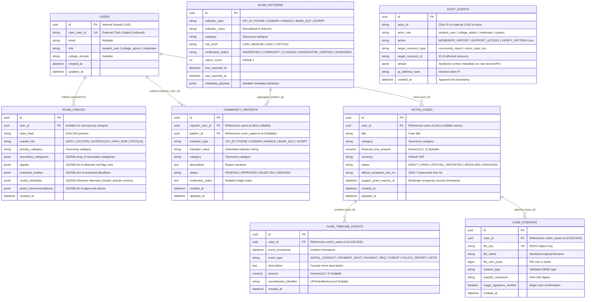

# Phase 3: Core Data Model & Migrations — Research

## 1. Relational Architecture & Entity-Relationship Schema

Scamfy requires a robust PostgreSQL relational schema with typed columns for relational integrity, JSONB for genuinely variable structured payloads (signals, entities, telemetry), and structural privacy boundaries.

---

## 2. Core Architectural Principles & Boundaries

### 1. Clerk Identity Boundary
- Internal Scamfy models reference internal UUID primary keys (`users.id`).
- External Clerk user IDs (`clerk_user_id`) are stored as unique, indexed string columns on the `users` table.
- This decouples internal foreign keys from external authentication provider schemas while allowing fast O(1) user lookups on authentication tokens.

### 2. Privacy Boundary: ScamCheck vs CommunityReport
- **`scam_checks`**: Represents private, read-heavy analysis sessions of untrusted text. Accessible anonymously (`SEC-01`, `user_id` is nullable). Results and input text are never automatically published or exposed in community intelligence.
- **`community_reports`**: Represents an intentional, authenticated user submission to the public/moderated scam pattern database (`REP-01`). `reporter_user_id` is non-nullable. When verified by a moderator, reports link to `scam_patterns` (`pattern_id`).
- Keeping these tables distinct ensures that private victim queries never inadvertently leak into community threat feeds.

### 3. Structural Privacy Chain: User -> VictimCase -> Evidence
- Victim case ownership is strictly rooted in `users.id`:
  $$\text{users.id} \xrightarrow{\text{1:N}} \text{victim\_cases.id} \xrightarrow{\text{1:N}} \text{case\_evidence.id}$$
- `case_evidence` records reference `victim_cases.id` with `ondelete="CASCADE"`.
- Ownership verification is structurally guaranteed by traversing `evidence.case.user_id == authenticated_user.id`.
- Moderator access is governed by the explicit temporal grant field `support_grant_expires_at` on `victim_cases` (`SEC-07`).

### 4. Append-Only Audit Trail (`SEC-06`)
- `audit_events` is strictly append-only.
- No update or delete operations are exposed in the repository or ORM interface.
- Stores privacy-safe metadata only: operator identifier, role, action, target resource, hashed IP, and sanitized payload details (strictly excluding raw PII, plain financial credentials, or private file keys).

### 5. Proper JSONB Usage vs Relational Columns
- **JSONB is used only for variable structured payloads**:
  - `scam_checks.signals` (list of triggered red flags and confidence weights)
  - `scam_checks.extracted_entities` (dictionary of entity arrays: URLs, UPIs, phones, accounts)
  - `scam_checks.model_metadata` (telemetry: model slug, temperature, prompt version `AI-04`)
  - `scam_patterns.metadata_payload` (context-dependent pattern attributes)
  - `audit_events.details` (variable audit event context)
- **Typed Relational Columns are used for all core attributes**:
  - Primary/foreign keys (`UUID`), status enums (`Enum`/`String`), financial loss amounts (`Numeric(12, 2)`), timestamps (`DateTime(timezone=True)`), checksums (`String(64)`), file sizes (`BigInteger`), counts (`Integer`).

---

## 3. Database Driver, Testing Strategy & Migrations

### 1. Dedicated PostgreSQL Testing Environment
- Rather than in-memory SQLite (which lacks native `UUID`, `JSONB` operators, and dialect-specific constraints), tests will execute against a **temporary PostgreSQL test database** (configured via `TEST_DATABASE_URL` / Docker container `scamfy_test_db`).
- This guarantees that PostgreSQL-specific behaviors (JSONB indexing, native UUID validation, constraint enforcement, Alembic autogenerate comparisons) are accurately tested.

### 2. Alembic Async Engine Integration
- `alembic.ini` and `backend/alembic/env.py` configured with `asyncpg` async connection pooling (`run_migrations_online` invoking `connection.run_sync(do_run_migrations)`).
- Baseline migration `0001_initial_schema.py` defines all 8 core tables with full bidirectional `upgrade()` and `downgrade()` procedures.

---

## 4. Scope Fences & Anti-Patterns to Avoid

1. **No UI or Business Logic**: Keep all UI components, scoring heuristics, Nemotron AI inference clients, Cloudflare R2 clients, and 1930 reporting integrations out of Phase 3.
2. **No Extra Domain Entities**: Do not add speculative domain models outside of the 8 core entities required by the requirements baseline.
