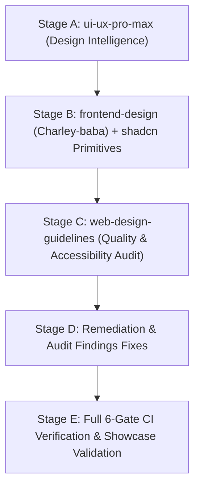

# Phase 4: Design System & Interaction Primitives — Context

- **Phase**: 04
- **Milestone**: Milestone 0 (Foundation)
- **Status**: Ready for Execution ⚪
- **Requirements Covered**: `UX-03`, `UX-04`, `UX-05` (Foundational design support for `UX-01`, `UX-02`, `DET-04`, `MULE-02`, `CASE-02`)

---

## 1. Executive Summary & Goals

Phase 4 establishes Scamfy's authoritative frontend design system, semantic design tokens, accessible interactive primitives, domain-specific presentation components, and development showcase.

As an educational, fraud-triage, and victim-support platform, Scamfy's visual identity must project **trust, calm authority, human empathy, and swift emergency action** without sensationalism, crypto-dashboard clutter, or hacker-movie tropes.

This phase equips all future vertical slices (Slice 1: Scam Check, Slice 2: Community Intel, Slice 3: Financial Traps, Slice 4: Victim Case Center) with a shared, accessible, battle-tested component library conforming strictly to WCAG 2.1 AA standards and keyboard operability.

---

## 2. Antigravity Design Skills & Phased Usage Workflow

Scamfy incorporates four specialized design skills that must be executed as distinct sequential stages rather than bundled interchangeably:

1. **Stage A — `ui-ux-pro-max` (Design Intelligence & Specification)**:
   - Sets information hierarchy, visual direction, design token taxonomy, typography pairings, spacing scale, responsive layout rules, accessibility UX decisions, risk-state iconography, and calm trust patterns.
2. **Stage B — `frontend-design` (Charley-baba/antigravity-skills) & `shadcn` (Accessible Primitives)**:
   - `frontend-design`: Crafts production-grade Next.js/React 19 code, layout composition, distinctive Scamfy visual identity, micro-interactions, responsive styling, and visual polish.
   - `shadcn`: Provides standard unstyled accessible primitives (`@radix-ui/react-*`), preventing reinvention of focus trapping, dialog overlays, and ARIA primitives while adopting Scamfy's customized tokens and styling.
3. **Stage C — `web-design-guidelines` (Review & Audit Gate)**:
   - Post-implementation comprehensive audit evaluating keyboard navigation, visible focus rings, ARIA roles, semantic HTML, contrast ratios (>= 4.5:1), touch targets (>= 44x44px), screen-reader announcements, and reduced-motion compliance.
4. **Stage D — Remediation**:
   - Fix all issues and warnings identified during the `web-design-guidelines` audit before declaring Phase 4 ready for completion.
5. **Stage E — Verification**:
   - Execute full 6-gate CI verification suite, automated component/accessibility tests, and showcase verification.

---

## 3. Trust & Safety Visual Language

Scamfy is a fraud-prevention and victim-support platform; its visual system must be reassuring, clear, and dignified.

### Risk Tier Hierarchy & Visual Semantics
Risk states must **never be communicated using color alone**. Every risk tier pairs semantic color with explicit text labels, distinct geometric shapes/badges, and recognizable icons:

| Risk Tier | Semantic Color Token | Icon / Visual Cue | Contrast Guarantee | Emotional Intent |
| :--- | :--- | :--- | :--- | :--- |
| **`SAFE`** | Emerald (`#065F46` on `#ECFDF5` light; `#34D399` on `#06241B` dark) | Shield Check (`ShieldCheck`) / Solid pill | >= 4.5:1 | Calm verification, reassurance. |
| **`CAUTION`** | Amber (`#92400E` on `#FFFBEB` light; `#FBBF24` on `#291804` dark) | Info Circle (`Info`) / Outline pill | >= 4.5:1 | Informational awareness, missing context. |
| **`SUSPICIOUS`** | Orange (`#9A3412` on `#FFF7ED` light; `#FB923C` on `#2D1306` dark) | Alert Triangle (`AlertTriangle`) / Tag badge | >= 4.5:1 | Heightened scrutiny, unverified claims. |
| **`HIGH_RISK`** | Rose (`#9F1239` on `#FFF1F2` light; `#FB7185` on `#2E0813` dark) | Alert Octagon (`AlertOctagon`) / Bordered badge | >= 4.5:1 | Urgent threat warning, high likelihood of scam. |
| **`CRITICAL`** | Crimson (`#FEF2F2` on `#450A0A` light/dark with `#EF4444` border) | Siren / Flame (`AlertCircle`) / High-contrast container | >= 7.0:1 | Active loss emergency / 1930 Helpline urgency. |

### Visual Identity Principles:
- **Calm & Professional**: Avoid alarmist blinking animations, flashing red screens, or fear-inducing copy.
- **Human & Empathetic**: Warm dark slate/charcoal tones (`#080C14`, `#0F172A`) with subtle glassmorphism and clear hierarchy.
- **Not a Crypto/Trading Platform**: No ticker-style charts, neon green/magenta speculative styling, or gamified tokens.
- **Not a Hacker Movie Aesthetic**: No matrix rain, terminal glow effects, or illegible sci-fi monospace themes.

---

## 4. Semantic Boundaries for Key Domain Components

### A. ConfidenceMeter Semantics
- **Strict Prohibition**: Must **NOT** imply legal certainty, absolute judicial guilt, guaranteed correctness, or authority over law enforcement investigations.
- **Approved Terminology**: Use labels such as *Analysis Confidence*, *Model Signal Confidence*, or *Rule Match Strength*.
- **Distinction**: Clearly separate the **Risk Tier** (severity of detected signals) from **Analysis Confidence** (completeness of data and signal alignment).

### B. UrgencyBanner Boundary
- **Phase 4 Scope**: Reusable presentation component displaying emergency helpline call-to-actions (e.g., National Cyber Crime Helpline 1930 / `tel:1930` deep link), incident warning text, and keyboard-accessible action buttons driven strictly by props.
- **Strict Prohibition**: No backend reporting integrations, no 1930 government API calls, no complaint submission workflows, and no tracking logic.

### C. EvidenceDropzone Boundary
- **Phase 4 Scope**: Purely presentation and client-side interaction component handling drag-and-drop, native file picker triggering, file name/size/type display, client-side format/size validation UI states, upload progress bar simulation props, error alerts, and disabled states.
- **Strict Prohibition**: No Cloudflare R2 uploads, no S3 presigned URLs, no database persistence, no server-side MIME sniffing, no SHA-256 hash generation, and no authorization checks.

### D. IndicatorTag
- **Supported Types**: `UPI_ID`, `PHONE`, `DOMAIN`, `HANDLE`, `BANK_ACC`, `SCRIPT`.
- **Requirements**: Clear type indicator pill, machine-readable monospace font, accessible 1-click clipboard copy button with visual checkmark transition and screen-reader ARIA live announcement, responsive layout (ellipsis/truncation for extreme lengths), and mobile touch support.

---

## 5. Scope Fences & Boundaries

| Category | In Scope for Phase 4 | Strictly Out of Scope (Phase 5+) |
| :--- | :--- | :--- |
| **UI Tokens & Themes** | Tailwind v4 `@theme`, CSS variables, dark/light mode, contrast tokens. | Hardcoded or ad-hoc style overrides. |
| **Component Primitives** | 12 core UI primitives (`Button`, `Input`, `Dialog`, etc.) + 7 domain primitives (`RiskBadge`, `ConfidenceMeter`, etc.). | Slice-specific business logic or form orchestration. |
| **Interactions** | Focus management, keyboard navigation (`UX-03`), modal Escape/trap, tooltips, clipboard copy, state feedback (`UX-05`). | Real asynchronous backend API calls or routing redirects. |
| **Showcase** | Development/recruiter showcase page (`/design-system`) demonstrating all tokens and components. | End-user product flows or public navigation menus. |
| **Backend / DB / AI** | None (100% frontend presentation). | Zero Prisma CRUD, zero PostgreSQL queries, zero Nemotron NIM inference, zero R2 storage. |
