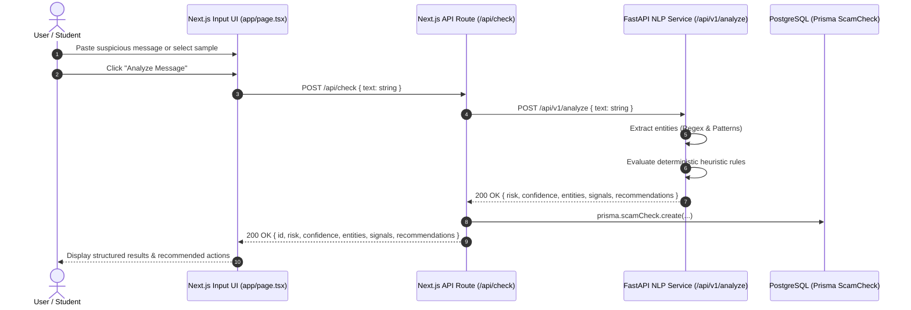

# Phase 5: Scam Check Input & Analysis Slice — Context

- **Phase**: 05
- **Milestone**: Milestone 1 (Slice 1 - Core Scam Check)
- **Status**: Complete ✅
- **Requirements Covered**: `DET-01`, `DET-03`, `DET-04`, `UX-01`, `SEC-01` (Foundational pipeline for `DET-02`, `DET-05`, `AI-01..05`)

---

## 1. Executive Summary & Goals

Phase 5 delivers Scamfy's **first end-to-end vertical tracer slice**: an intuitive, trustworthy, accessible scam analysis workflow allowing users (both anonymous and authenticated) to submit suspicious text, extract structured entities, receive deterministic heuristic risk analysis, and view clear, actionable recommendations.

This phase connects all layers of Scamfy:
1. **Frontend UI**: Calm, accessible input interface (`app/page.tsx`) utilizing Phase 4 UI components (`Textarea`, `Button`, `RiskBadge`, `ConfidenceMeter`, `IndicatorTag`, `UrgencyBanner`, `StateFeedback`).
2. **Next.js Server / BFF**: Route handler (`/api/check`) managing input hashing (SHA-256), rate limiting/sanitization, and Prisma persistence to the `ScamCheck` domain table (`SEC-01`, `SEC-04`).
3. **FastAPI Stateless AI/NLP Service**: Fast, validated endpoint (`POST /api/v1/analyze`) providing deterministic entity extraction (UPI IDs, phone numbers, URLs, emails, bank accounts, amounts) and baseline heuristic risk scoring.
4. **Explainable Results UI**: High-contrast, structured breakdown of risk severity, confidence level, extracted indicators, and immediate recommended actions (`UX-01`).

---

## 2. Requirements & Traceability

- **`DET-01`**: Accept suspicious text (SMS, WhatsApp, emails, job postings, payment demands, APK lure messages) as input with character limits and pre-populated scam templates.
- **`DET-03`**: Extract structured entities with high precision:
  - **UPI IDs**: Valid Indian VPA patterns (e.g. `user@okhdfcbank`, `merchant@paytm`, `9876543210@ybl`).
  - **Phone Numbers**: Indian mobile numbers (`+91`, standard 10-digit formats).
  - **URLs & Domains**: Phishing links, suspicious TLDs, IP URLs, shorteners.
  - **Email Addresses**: Suspicious sender addresses and impersonations.
  - **Monetary Figures**: INR (`₹`, `Rs`, `INR`) and currency figures.
  - **Handles / Accounts**: Telegram handles (`@username`), IFSC codes, bank account numbers.
- **`DET-04`**: Display concrete, explainable signals (e.g. urgency keywords, suspicious APK lure, unverified payment request) contributing to the risk assessment.
- **`UX-01`**: For every risk tier (especially `HIGH_RISK` and `CRITICAL`), render unambiguous, prioritized next steps (e.g. "Do not approve UPI PIN prompt", "Call 1930 immediately", "Block contact").
- **`SEC-01`**: Support anonymous scam analysis without mandatory user login; store analysis records linked to `userId: null` while hashing inputs (`inputHash`).

---

## 3. Architecture & Data Flow

---

## 4. Strict Scope Fences for Phase 5

- ❌ **No Nemotron NIM / LLM API calls in Phase 5**: Phase 5 builds the deterministic extraction & heuristic analysis pipeline. NVIDIA Nemotron NIM integration, prompt versioning, and LLM evaluations are strictly isolated to **Phase 6** (`AI-01..05`).
- ❌ **No R2 Object Storage uploads**: File attachment analysis and screenshot OCR belong to victim cases (`CASE-04`). Phase 5 handles direct text input and client-side extraction.
- ❌ **No Community Report mutations**: Creating public scam database entries (`ScamPattern` / `CommunityReport`) belongs to **Phase 7** (`REP-01..05`).
- ❌ **No external government APIs**: Direct 1930 / cybercrime.gov.in complaint submission is planned for **Phase 10** (`OFF-01..06`).

---

## 5. Definition of Done (Verification Gates)

1. `npm run typecheck` passes with zero TypeScript errors across Next.js pages and API routes.
2. `npm run lint` passes cleanly with zero ESLint errors and zero warnings.
3. `npm run test:run` passes Vitest component and API integration tests.
4. `npm run build` succeeds cleanly.
5. `python -m ruff check backend/` & `python -m ruff format --check backend/` pass.
6. `python -m pytest backend/tests` passes all FastAPI extraction and analysis tests.
7. `powershell -ExecutionPolicy Bypass -File scripts/verify.ps1` confirms all 6 gates pass.
