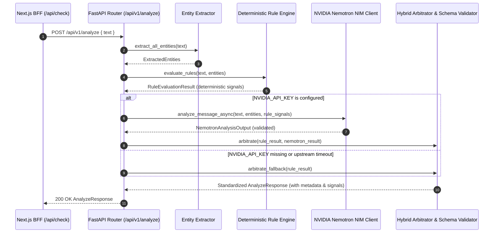

# Phase 6: Deterministic Risk Engine + NVIDIA Nemotron Analysis — Context

- **Phase**: 06
- **Milestone**: Milestone 1 (Slice 1 - Core Scam Check)
- **Status**: 🟢 Complete
- **Requirements Covered**: `DET-02`, `DET-05`, `AI-01`, `AI-02`, `AI-03`, `AI-04`, `AI-05`, `ENG-01`, `ENG-02`

---

## 1. Executive Summary & Goals

Phase 6 completes **Milestone 1 (Slice 1 - Core Scam Check)** by advancing Scamfy's triage engine from baseline regex heuristics into a robust **hybrid threat evaluation system**:
1. **Deterministic Red-Flag Rule Engine**: Independent rule evaluation covering prevalent Indian cyber frauds (UPI PIN reverse traps, Digital Arrest, utility disconnection, task commission scams, loan APK traps, customs parcel extortion) with 100% unit test coverage (`AI-01`, `ENG-01`).
2. **Explicit Uncertainty & Missing Evidence Modeling**: Systems explicitly surface missing corroborating evidence and uncertainty instead of hallucinating facts or treating unknown input as verified safe (`DET-05`).
3. **Server-Side NVIDIA Nemotron NIM Integration**: Asynchronous server-side client calling NVIDIA NIM (`nvidia/llama-3.1-nemotron-70b-instruct`) for deep linguistic analysis, subtle social engineering detection, and structured explanation synthesis (`AI-02`, `SEC-02`).
4. **Typed Pydantic Schema Contracts**: Strict validation of model outputs against `NemotronAnalysisOutput` schemas before downstream consumption, with graceful fallback to deterministic rules if API keys are unset or upstream times out (`AI-03`).
5. **Metadata & Legal Transparency**: Full audit trail of model slugs, prompt versions, parameters, and explicit disclaimer that automated assessments do not constitute formal legal determinations (`AI-04`, `AI-05`).

---

## 2. Requirements & Traceability

- **`DET-02`**: Identify primary and secondary scam categories supported by available evidence.
- **`DET-05`**: Explicitly distinguish uncertainty, unverified claims, and missing evidence from verified facts.
- **`AI-01`**: Deterministic scam red-flag rules execute independently of the LLM; critical rules override model downgrades.
- **`AI-02`**: NVIDIA Nemotron accessed strictly server-side through NVIDIA NIM API layer; API keys remain server-side.
- **`AI-03`**: LLM output validated against typed Pydantic backend schemas before downstream consumption.
- **`AI-04`**: Preserve metadata identifying model slug, prompt version, temperature, and latency.
- **`AI-05`**: State clearly that automated triage does not constitute a legal or regulatory determination.
- **`ENG-01`**: Deterministic rule logic and calculations have 100% unit test coverage.
- **`ENG-02`**: AI integration responses and Pydantic schemas have automated contract tests.

---

## 3. Architecture & Data Flow

---

## 4. Strict Scope Fences for Phase 6

- ❌ **No Community Report mutations**: Submitting, moderating, or indexing community indicators belongs to **Phase 7** (`REP-01..05`).
- ❌ **No Money-Mule transfer guidance flows**: Bank transfer warnings and mule detection flows belong to **Phase 8** (`MULE-01..03`).
- ❌ **No Loan APR calculator UI**: Mathematical APR and hidden fee calculators belong to **Phase 9** (`LOAN-01..03`).
- ❌ **No 1930 / cybercrime.gov.in API submissions**: Official reporting gateway belongs to **Phase 10** (`OFF-01..06`).
- ❌ **No Case timeline or R2 document storage**: Victim evidence vault belongs to **Phase 11** (`CASE-01..06`).

---

## 5. Definition of Done (Verification Gates)

1. `npm run typecheck` passes with zero TypeScript compiler errors.
2. `npm run lint` passes with zero ESLint warnings or errors.
3. `npm run test:run` passes all Vitest component, accessibility, and integration tests.
4. `npm run build` compiles Next.js production bundle with zero errors.
5. `python -m ruff check backend/` and `python -m ruff format --check backend/` pass cleanly.
6. `python -m pytest backend/tests` passes all deterministic rules and Nemotron contract test suites.
7. `scripts/verify.ps1` runs and validates all 6 canonical gates.
