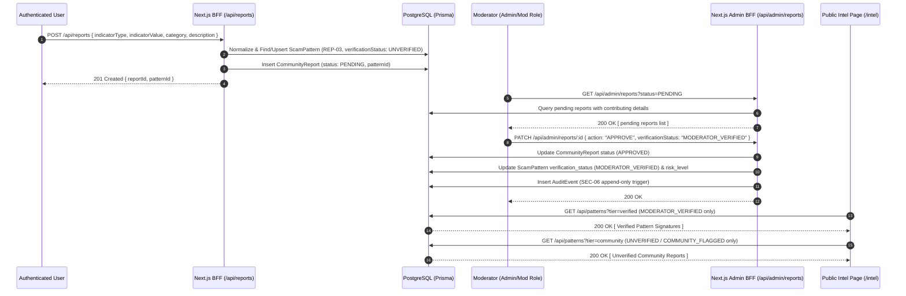

# Phase 7: Scam Pattern Database & Community Reporting — Context

- **Phase**: 07
- **Milestone**: Milestone 2 (Slice 2 - Community Intel & Mule Shield)
- **Status**: Ready for Execution ⚪
- **Requirements Covered**: `REP-01`, `REP-02`, `REP-03`, `REP-04`, `REP-05`, `SEC-06`, `UX-03`, `UX-04`, `UX-05`

---

## 1. Executive Summary & Goals

Phase 7 initiates **Milestone 2 (Slice 2 - Community Intel & Mule Shield)** by building Scamfy's community-driven scam intelligence layer and pattern database:
1. **Authenticated Indicator Submission (`REP-01`, `REP-02`)**:
   - Enables verified users to submit suspicious identifiers (UPI VPAs, phone numbers, phishing URLs/domains, social handles, predatory APK links, scam scripts) with category, description, and timestamp metadata.
2. **Automated Indicator Normalization & Deduplication (`REP-03`)**:
   - Implements strict identifier sanitization and composite matching (`[indicatorType, indicatorValue]`) on `ScamPattern`.
   - Links multiple user reports to a unified `ScamPattern` without losing individual reporter provenance, increments `reportCount`, and updates `lastReportedAt`.
   - **Critical Invariant**: Multiple reports increment `reportCount`, but `reportCount` alone MUST NEVER automatically transition an indicator to verified status.
3. **Public Threat Intelligence Directory (`REP-04`)**:
   - Builds an interactive public intelligence exploration dashboard at `/intel`.
   - **Strict Verification Tier Separation (`REP-04`)**:
     - **Verified Pattern Signatures (`MODERATOR_VERIFIED`)**: Confirmed active cybercrime pattern signatures that passed explicit human moderator verification.
     - **Unverified Community Reports (`UNVERIFIED` / `COMMUNITY_FLAGGED`)**: Raw submissions with clear unverified labeling; never presented as confirmed threats or authoritative findings.
   - Distinct visual treatments, separate filtered streams, and zero visual or semantic ambiguity between verified patterns and unverified community reports.
   - **Anti-Doxxing & Non-Legal Guardrails (`OOS-04`, `AI-05`)**: Indicators are presented purely as technical patterns without vigilante accusations, public blacklists of individuals, or legal determinations of guilt.
4. **Moderator Review, Triage & Audit Trail (`REP-05`, `SEC-06`)**:
   - Provides administrative moderation endpoints (`/api/admin/reports`) and UI to approve, reject, merge, or dismiss reports.
   - Enforces append-only immutable `AuditEvent` generation for all moderation actions per `SEC-06`.
   - Rejection/dismissal does not leave stale UI states; merges preserve contributing report provenance; private reporter data and internal moderation notes are never leaked in public endpoints.

---

## 2. Requirements & Traceability

- **`REP-01`**: Authenticated users shall be able to submit suspicious indicators (handles, URLs, phone numbers, scripts, offers).
- **`REP-02`**: Submitted reports shall preserve provenance, verification level, and timestamp metadata.
- **`REP-03`**: Duplicate or overlapping indicator submissions shall be deduplicated and linked without losing individual provenance.
- **`REP-04`**: Public community views shall strictly separate unverified user reports from verified pattern signatures.
- **`REP-05`**: Authorized moderators shall have tooling to review, merge, verify, suppress, or correct reports.
- **`SEC-06`**: Moderator actions and pattern verifications produce immutable `AuditEvent` logs.
- **`UX-03`, `UX-04`, `UX-05`**: Accessible dialogs, keyboard navigation, high contrast risk badges, empty/loading state feedback.

---

## 3. Architecture & Data Flow

---

## 4. Strict Scope Fences for Phase 7

- ❌ **No Money-Mule transfer guidance flows**: Bank transfer warnings and mule recruitment detectors belong to **Phase 8** (`MULE-01..03`).
- ❌ **No Loan APR calculator UI**: Mathematical APR and hidden fee calculators belong to **Phase 9** (`LOAN-01..03`).
- ❌ **No 1930 / cybercrime.gov.in automated API submissions**: Official reporting gateway belongs to **Phase 10** (`OFF-01..06`).
- ❌ **No Case timeline or R2 document storage**: Victim evidence vault belongs to **Phase 11** (`CASE-01..06`).
- ❌ **No Public Doxxing / Unvetted Citizen Blacklists**: Adhere strictly to `OOS-04`.
- ❌ **No Auto-Promotion by Volume**: `reportCount` accumulation cannot promote items to `MODERATOR_VERIFIED` without human moderation review.

---

## 5. Definition of Done (Verification Gates)

1. `npm run typecheck` passes with zero TypeScript errors.
2. `npm run lint` passes with zero ESLint warnings or errors.
3. `npm run test:run` passes all Vitest unit, component, route, and moderation integration tests.
4. `npm run build` compiles Next.js production build cleanly.
5. `python -m ruff check backend/` and `python -m ruff format --check backend/` pass.
6. `python -m pytest backend/tests` passes all backend test suites.
7. `scripts/verify.ps1` runs and validates all 6 canonical gates.
