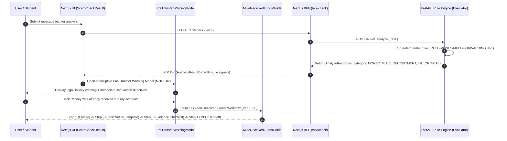

# Phase 8: Money-Mule Protection & Transfer Warnings — Context

- **Phase**: 08
- **Milestone**: Milestone 2 (Slice 2 - Community Intel & Mule Shield)
- **Status**: Planning 📋
- **Requirements Covered**: `MULE-01`, `MULE-02`, `MULE-03`, `UX-02`, `UX-03`, `UX-04`, `UX-05`
- **Scope Fences**: Zero direct bank account manipulation or credential access (`OOS-01`), zero chargeback or money recovery guarantees (`OOS-02`), zero automated legal/criminal determinations of guilt (`OOS-03`, `AI-05`), zero predatory loan APR calculators (Phase 9), zero automated 1930 API submissions (Phase 10), zero full victim case center vaults or R2 document storage (Phase 11).

---

## 1. Executive Summary & Goals

Phase 8 completes **Milestone 2 (Slice 2 - Community Intel & Mule Shield)** by establishing Scamfy's Money-Mule Protection system:
1. **Mule Pattern Detection Engine (`MULE-01`)**:
   - Extends the deterministic rule engine and Nemotron extraction layers to accurately identify money-mule recruitment patterns (funds forwarding, account rental, crypto P2P arbitrage, overpayment reversal tricks).
2. **Interruptive Pre-Transfer Warning System (`MULE-02`, `UX-02`)**:
   - Triggers an immediate, prominent pre-transfer warning modal on any analysis where money mule patterns or high-risk transfer demands are detected.
   - Educates users on severe legal liabilities under Indian law (CrPC Section 102 account freezing, PMLA, accomplice liability).
   - Provides clear, authoritative immediate safe-action directives: **DO NOT SEND / FORWARD FUNDS**, **DO NOT TOUCH OR WITHDRAW RECEIVED MONEY**, **REFUSE PROPOSAL**.
3. **Guided Workflow for Received Funds & Evidence Preservation (`MULE-03`)**:
   - Provides a step-by-step emergency workflow when a user has already received money into their personal account.
   - Generates a copyable formal written notification template for bank nodal officers/branch managers requesting a voluntary transaction lien.
   - Provides an evidence preservation checklist (chat logs, handles, transfer instructions, SMS alerts).
   - Provides official 1930 / cybercrime.gov.in informational complaint guidance.

---

## 2. Requirements & Traceability

- **`MULE-01`**: The system shall detect patterns where an individual is requested to receive funds into a personal account and forward or withdraw them.
- **`MULE-02`**: High-risk money-mule patterns shall trigger an interruptive pre-transfer warning and immediate safe-action guidance.
- **`MULE-03`**: The user shall be provided a guided workflow to preserve communications and transaction details if money has already been received.
- **`UX-02`**: Emergency financial fraud guidance shall be immediately prominent on high-urgency flows.
- **`UX-03`, `UX-04`, `UX-05`**: Accessible dialogs, keyboard navigation, high contrast risk badges, empty/loading/feedback state recovery paths.

---

## 3. Architecture & Data Flow

---

## 4. Strict Scope Fences for Phase 8

- ❌ **No direct bank/UPI account credential access or API fund freezing**: Respect `OOS-01`.
- ❌ **No promises of automated money recovery, chargebacks, or reversals**: Respect `OOS-02`.
- ❌ **No automated judicial or legal guilt determinations**: Respect `OOS-03`, `AI-05`.
- ❌ **No Predatory Loan APR & fee calculators**: Belongs to **Phase 9** (`LOAN-01..03`).
- ❌ **No 1930 / cybercrime.gov.in automated API integration**: Belongs to **Phase 10** (`OFF-01..06`).
- ❌ **No Victim Case Vault or R2 document storage**: Belongs to **Phase 11** (`CASE-01..06`).

---

## 5. Definition of Done (Verification Gates)

1. `npm run typecheck` passes with zero TypeScript errors.
2. `npm run lint` passes with zero ESLint warnings or errors.
3. `npm run test:run` passes all Vitest unit, component, and integration tests.
4. `npm run build` compiles Next.js production build cleanly.
5. `python -m ruff check backend/` and `python -m ruff format --check backend/` pass.
6. `python -m pytest backend/tests` passes all backend test suites.
7. `scripts/verify.ps1` runs and validates all 6 canonical gates.
