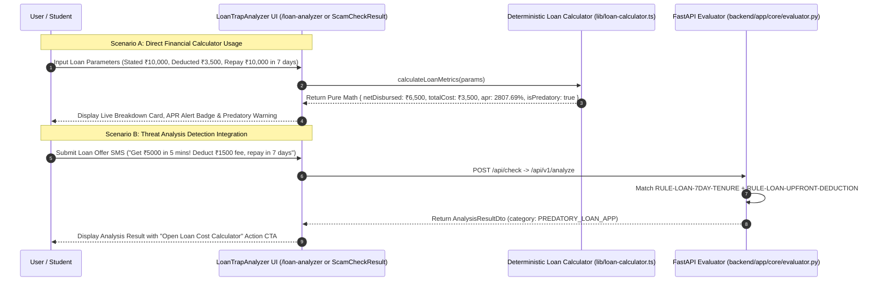

# Phase 9: Loan & High-Return Trap Analyzer — Context

- **Phase**: 09
- **Milestone**: Milestone 3 (Slice 3 - Financial Trap Engine & Regulatory Verification)
- **Status**: Planning 📋
- **Requirements Covered**: `LOAN-01`, `LOAN-02`, `LOAN-03`, `DET-02`, `DET-04`, `DET-05`, `UX-01`, `UX-03`, `UX-04`, `UX-05`
- **Scope Fences**: Zero direct bank account manipulation (`OOS-01`), zero recovery guarantees (`OOS-02`), zero automated legal determinations of guilt (`OOS-03`, `AI-05`), zero undocumented external government API fabrications (`OOS-05`), zero victim case center vault uploads (Phase 11).

---

## 1. Executive Summary & Goals

Phase 9 establishes Scamfy's **Loan & High-Return Trap Analyzer (Slice 3)** to protect students and vulnerable individuals from predatory instant loan apps, advance-fee lending fraud, and mathematically impossible investment schemes:

1. **Deterministic Financial Calculation Engine (`LOAN-01`, `LOAN-02`)**:
   - Provide auditable, pure mathematical formulas calculating true borrowing costs, net disbursement vs. total repayment, upfront fee percentages, and annualized percentage rates (APR/EAR).
   - Provide investment yield calculation converting promised daily/weekly/monthly payouts into effective annual percentage yields (APY) compared against authoritative benchmarks (RBI Repo Rate, Nifty historical CAGR).
   - Strictly decouple pure mathematical calculations from AI model-assisted contextual summaries per `LOAN-02`.

2. **Detection Rules for Predatory Financial Traps (`DET-02`, `DET-04`)**:
   - Extend backend rule evaluator with deterministic detection for:
     - 7-day hyper-short tenure loan schemes.
     - Upfront processing deduction traps.
     - Contact book harvesting and recovery harassment threats.
     - Advance fee / deposit demands for loan approval.
     - Guaranteed daily/weekly compounding investment traps (BUDS Act triggers).

3. **Authoritative Lender & Scheme Verification Checklist (`LOAN-03`)**:
   - Provide an interactive verification guide referencing official regulatory mechanisms:
     - RBI Sachet Portal (`sachet.rbi.org.in`) and registered NBFC list verification.
     - Mandatory RBI Key Fact Statement (KFS) checklist.
     - Permission auditing (identifying excessive contact/gallery access demands).
     - Direct account-to-account lending flow compliance.

4. **Dedicated Interactive UI & Seamless Analysis Integration (`UX-01`, `UX-03`, `UX-04`, `UX-05`)**:
   - Deliver `components/domain/loan-trap-analyzer.tsx` with responsive, accessible calculator sliders, preset scenario buttons, real-time APR breakdown cards, and visual risk indicators.
   - Deliver dedicated standalone route `app/loan-analyzer/page.tsx` for direct bookmarking and awareness sharing.
   - Integrate loan and yield analyzer triggers into `components/domain/scam-check-result.tsx` when financial trap indicators are detected during standard message scanning.

---

## 2. Requirement Traceability

- **`LOAN-01`**: The system shall calculate transparent mathematical relationships between stated loan amount, actual disbursement, total repayment, hidden fees, tenure, and implied interest rates.
- **`LOAN-02`**: The system shall clearly separate calculated mathematical facts from model-assisted interpretations.
- **`LOAN-03`**: The system shall support authoritative lender identity and registration checks when registry sources are available.
- **`DET-02` / `DET-04`**: Identify primary/secondary categories (`PREDATORY_LOAN_APP`, `INVESTMENT_PONZI_FRAUD`) with concrete auditable signals.
- **`DET-05`**: Distinguish missing evidence (e.g., absence of registered NBFC name or KFS) rather than asserting unsupported claims.
- **`UX-01` / `UX-03` / `UX-04` / `UX-05`**: Clear recommended next action, full keyboard accessibility, WCAG AA color contrast, and graceful fallback states.

---

## 3. Architecture & Data Flow

---

## 4. Definition of Done (Verification Gates)

1. `npm run typecheck` passes with zero TypeScript errors.
2. `npm run lint` passes with zero ESLint warnings or errors.
3. `npm run test:run` passes all Vitest unit, component, and integration test suites.
4. `npm run build` compiles Next.js production build cleanly.
5. `python -m ruff check backend/` and `python -m ruff format --check backend/` pass.
6. `python -m pytest backend/tests` passes all backend test suites with 100% success.
7. `scripts/verify.ps1` runs and validates all 6 canonical gates.
