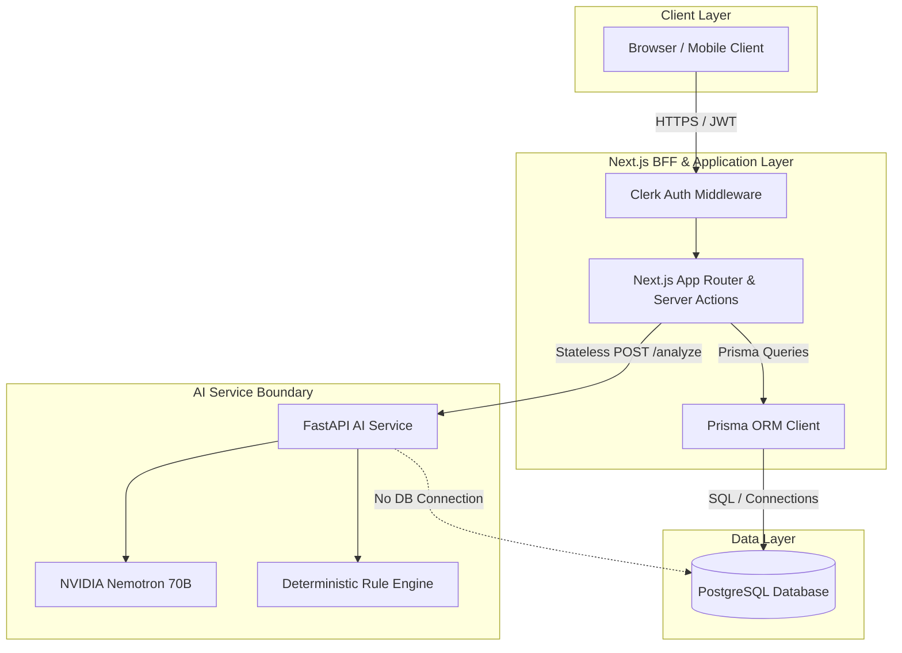

# ADR 0001: Prisma ORM for Domain Persistence and FastAPI as Stateless AI Service Boundary

- **Status**: Accepted
- **Date**: 2026-09-25
- **Deciders**: Scamfy Architecture & Core Engineering Team
- **Requirements Covered**: `SEC-01`, `SEC-06`, `SEC-07`, `CASE-01..04`, `REP-01..03`, `AI-04`

---

## 1. Context & Problem Statement

Scamfy is a full-stack anti-fraud intelligence platform comprising a Next.js (App Router, TypeScript) frontend/BFF and a Python service for AI/NLP inference (NVIDIA Nemotron 70B, extraction heuristics, and rule evaluation).

We require a robust, maintainable, and type-safe database architecture for PostgreSQL that fulfills the following needs:
1. **End-to-End TypeScript Type Safety**: The primary application logic, user session management, case workflows, community reports, and API routes reside in the Next.js TypeScript layer. Dual-maintaining Python ORM schemas (SQLAlchemy) and TypeScript interfaces creates synchronization drift and redundant type definitions.
2. **Clear Ownership of Schema & Migrations**: A single runtime and toolchain must own the database schema, migration authority, and connection lifecycle to eliminate migration conflicts.
3. **Stateless AI Service Boundary**: The Python service specializes in compute-heavy AI/NLP workloads (running Nemotron inference, deterministic regex/heuristic signal extraction, and telemetry). Direct database mutations from Python would create tight coupling, dual-ORM drift, and bypass BFF access controls.

---

## 2. Decision

We decide to:
1. **Designate Prisma ORM as the Single Schema Authority and Application Persistence Layer**:
   - The Next.js server / Backend-for-Frontend (BFF) owns all database operations, transactional boundaries, and domain persistence using **Prisma ORM** (`prisma`, `@prisma/client`, `prisma migrate`).
   - The PostgreSQL database schema is defined authoritatively in `prisma/schema.prisma`.
   - Database migrations are generated, version-controlled, and executed exclusively through `prisma migrate`.
   - Prisma Client generates strictly-typed TypeScript interfaces utilized across Next.js Server Components, Server Actions, and Route Handlers.

2. **Retain FastAPI as a Stateless AI/NLP Service Boundary**:
   - FastAPI is strictly dedicated to AI inference, deterministic rule scoring, and prompt orchestration.
   - FastAPI communicates with Next.js via stateless HTTP/JSON endpoints (e.g., `POST /api/v1/analyze`).
   - FastAPI does **not** directly connect to, query, or mutate the Scamfy PostgreSQL domain tables.
   - All persistence of AI check results (`ScamCheck`), telemetry, user cases (`VictimCase`), and audit logs (`AuditEvent`) is orchestrated by the Next.js BFF using Prisma Client after receiving the structured inference response from FastAPI.

3. **Enforce Structural Privacy & Security Invariants in Prisma**:
   - **Clerk Identity Boundary**: `User.id` (UUID PK) is the internal reference for all foreign keys, while `User.clerkUserId` (unique, indexed string) handles O(1) external auth lookups.
   - **Strict Privacy Isolation**: `ScamCheck` (private/anonymous analysis sessions) is stored in a separate table from `CommunityReport` (public/moderated submissions) (`SEC-01`, `REP-01..03`).
   - **Structural Evidence Privacy Chain**: `User -> VictimCase -> CaseEvidence / CaseSupportGrant` with cascading deletes (`SEC-07`, `CASE-01..04`).
   - **Deduplicated Indicators**: `ScamPattern` enforces composite uniqueness on `@@unique([indicatorType, indicatorValue])` (`REP-03`).
   - **Append-Only Audit Trail**: `AuditEvent` records are immutable; database triggers and Prisma middleware/client extensions prevent `update` and `delete` operations (`SEC-06`).

---

## 3. Consequences

### Positive
- **Complete Type Safety**: Zero type drift between database schema and application code. Full autocomplete and compile-time type validation in TypeScript.
- **Single Migration Authority**: `prisma migrate` provides predictable, deterministic migration history without managing dual migration engines.
- **Architectural Decoupling**: FastAPI remains a lightweight, stateless microservice that can be scaled independently, mocked in frontend tests, or refactored without altering database schemas.
- **Clean Access Control**: All business authorization (Clerk session validation, role-based access, support grant verification) is centralized in the Next.js BFF before touching the database.

### Negative / Trade-offs
- Python AI service cannot directly query historical database tables; any context required for inference (e.g., matching known pattern indicators) must be passed in the request payload from the BFF or queried via a dedicated read-only cache/API.

---

## 4. Architecture Diagram

