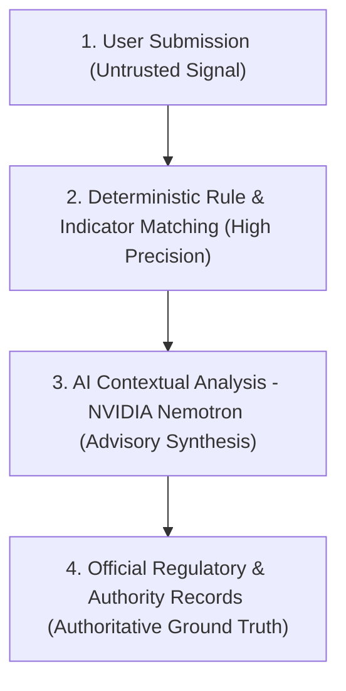

# Scamfy — Safety Boundaries & Legal Posture Specification

## 1. Executive Safety Principles

Scamfy is an automated fraud-prevention, risk-explanation, and evidence-organization platform focused on protecting students and young adults from financial cyber fraud and predatory schemes.

> **Core Platform Mantra:**
> *Before money moves, help the user understand the risk. After money moves, help the user act quickly, preserve evidence, and reach the correct official channel.*

---

## 2. Invariant Product & Legal Trust Boundaries

Scamfy operates under four strictly defined trust layers:

### Trust Boundary Definitions
1. **User Submissions & Community Reports**:
   - Treated strictly as unverified indicators, hypotheses, and user-provided evidence.
   - User submissions are **never** treated as proven factual claims or criminal convictions against named entities or phone numbers.
2. **Deterministic Rules & Signatures**:
   - Programmatic rules (e.g. UPI PIN requested to receive funds, upfront fee for data-entry job, APK download links) execute independently of AI inference.
3. **AI Inference (NVIDIA Nemotron via NIM)**:
   - Evaluates linguistic manipulation, contextual deception, and high-risk anomalies.
   - **Advisory Invariant**: AI output is purely advisory guidance and decision-support. AI output is never represented as legal advice or law enforcement findings.
4. **Official Channels & Regulatory Registries**:
   - Official routing (e.g., Indian Cyber Crime Helpline 1930 / `cybercrime.gov.in`, RBI regulated entity lists) is the sole source of official authority.

---

## 3. Explicit Non-Goals & Out-of-Scope Constraints (OOS Invariants)

Scamfy strictly enforces the following non-goals across product interfaces and backend logic:

- **OOS-01 — No Direct Banking or UPI Control**: Scamfy shall never request credentials, API tokens, or direct write/debit access to user bank accounts, credit cards, or UPI apps.
- **OOS-02 — No Recovery Guarantees**: Scamfy shall never promise, advertise, or imply guaranteed recovery or refund of stolen funds.
- **OOS-03 — No Automated Legal Judgments**: Scamfy does not decide legal guilt, innocence, or statutory liability.
- **OOS-04 — No Public Doxxing or Vigilantism**: Scamfy shall never publish unverified private personal data, defamatory feeds, or public blacklists of individual private citizens.
- **OOS-05 — No Fabricated Government APIs**: Scamfy will not spoof or fabricate automated complaint submission APIs where official machine-to-machine integrations do not exist; it uses guided copy-paste workflows and deep links.
- **OOS-06 — No Social Networking Feeds**: Scamfy is a focused security utility; social vanity metrics (likes, follows, public chat rooms) are excluded.

---

## 4. Mandatory Legal & Advisory Disclaimers

### Universal Banner Copy
Every scan result, report export, and case summary must include the standard disclaimer:

> **Notice:** *Scamfy provides automated risk analysis and educational guidance based on detected patterns. It does not provide legal advice, financial advice, or official criminal determinations. If you have transferred money in an active scam, immediately dial **1930**, contact your issuing bank's fraud desk to dispute the transaction and secure your account/cards, or report to **cybercrime.gov.in**.*

### Incident Response Guidance by Transfer Age

#### 1. Emergency Golden-Hour Prioritization (< 24 Hours)
When the user indicates that a financial transfer has occurred within the past 24 hours:
1. Normal UI is superseded by the **Emergency Action Banner**.
2. Immediate priority action instructions are displayed:
   - **Call 1930** immediately to alert intermediary and beneficiary banks to freeze funds in transit.
   - Lodge an official complaint on **cybercrime.gov.in** with transaction UTR/RRN numbers.
   - Inform the issuing bank's fraud desk to freeze/dispute the associated account, UPI handle, or card.
3. The platform immediately transitions into **Evidence Preservation Mode** to collect screenshots, receipts, and timestamps before evidence is deleted by the fraudster.

#### 2. Standard Incident & Account Protection (Any Age)
For fraudulent transfers occurring beyond 24 hours or recurring unauthorized debits:
1. Provide guided instructions to contact the issuing bank's fraud and dispute department to flag unauthorized transactions, dispute charges, and block compromised credentials/cards.
2. Guide formal complaint filing on **cybercrime.gov.in** with full transaction timelines and beneficiary account details.
3. Organize evidence through the Victim Case Center for documentation and dispute support.

---

## 5. Evidence Handling & File Integrity Invariants

1. **Independent Content-Signature Verification**:
   - Declared client MIME types are discarded as untrusted.
   - The backend enforces deep magic-byte and file signature inspection before acceptance, strictly rejecting polyglots, dual-extension tricks, and disguised executables.
2. **Quarantine & Malware Scanning**:
   - Uploaded files are staged into an isolated quarantine zone and scanned for malware and web shells before persistence to the private evidence vault.
3. **Non-Executable Storage & Safe Serving**:
   - Evidence object storage buckets have direct public access and script execution disabled.
   - Files are retrieved exclusively via short-lived signed URLs with forced `Content-Disposition: attachment` and `X-Content-Type-Options: nosniff` headers to prevent browser-level script execution.
4. **Metadata Privacy**:
   - EXIF metadata (GPS coordinates, device serials) is scrubbed from uploaded images upon ingestion to protect victim physical safety.
