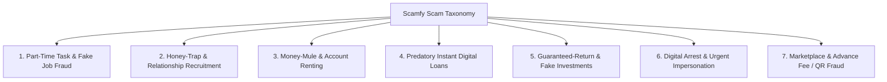

# Scamfy — Comprehensive Scam Taxonomy & Signal Matrix

## 1. Overview
This taxonomy categorizes the 7 primary cyber-financial fraud and predatory schemes targeted at students and young adults. It outlines the specific detection signals, separating high-confidence **Deterministic Red Flags** (instant trigger) from **Contextual Risk Indicators** (evaluated via NVIDIA Nemotron).

---

## 2. Seven Core Scam Categories



---

### Category 1: Part-Time Task & Fake Job Fraud (`CAT_JOB_TASK`)
- **Description**: Offers of easy online earnings (e.g. liking YouTube videos, writing fake Google reviews, rating hotels, data entry) that transition into requiring upfront "prepaid tasks" or deposits to release earnings.
- **Deterministic Red Flags**:
  - Request for registration fee, training fee, or security deposit before starting.
  - Requirement to deposit money into a "wallet" to unlock higher-paying task tiers.
  - Initial micro-payout (e.g. ₹150) followed by a large lock-in demand (e.g. ₹5,000 to withdraw).
- **Contextual Signals**:
  - Unsolicited WhatsApp/Telegram reachout claiming to represent global brands (Amazon, YouTube, HR recruiters).
  - Use of free email domains (@gmail.com) for official corporate hiring.

---

### Category 2: Honey-Trap / Relationship-Based Financial Recruitment (`CAT_ROMANCE_FINANCIAL`)
- **Description**: Social engineering where scammers establish fast emotional, romantic, or friendly intimacy on dating apps (Tinder, Bumble, Hinge) or social networks (Instagram), then steer the victim into financial transactions, fake investment platforms, emergency loan requests, or money-mule activity.
- **Deterministic Red Flags**:
  - "My relative/mentor has exclusive inside access to a guaranteed crypto/gold/forex platform; let me teach you."
  - Demanding urgent money transfer for "customs clearance", "medical emergency", or "travel tickets" before meeting.
- **Contextual Signals**:
  - Refusal or repeated cancellation of video calls or in-person meetings.
  - Rapid escalation from casual chatting to talk of shared financial future and wealth-building.
  - Pressure to move conversation from the dating platform to encrypted channels (Telegram/WhatsApp).

---

### Category 3: Money-Mule & Account Renting (`CAT_MONEY_MULE`)
- **Description**: Recruiting students to allow third-party funds to pass through their personal bank accounts, UPI IDs, or crypto wallets in exchange for a percentage commission.
- **Deterministic Red Flags**:
  - "Receive ₹50,000, keep 10% (₹5,000), and transfer the rest via UPI / Crypto / Cash."
  - Offers to "rent" or "buy" bank accounts, debit cards, or netbanking credentials.
  - Providing third-party login credentials or QR codes for cash collection.
- **Contextual Signals**:
  - Justification given as "cross-border payroll", "gaming tournament winnings", or "tax optimization".
  - Instructions to use cash deposit machines (CDMs) or buy USDT on P2P exchanges.

---

### Category 4: Predatory Instant Digital Loans (`CAT_LOAN_PREDATORY`)
- **Description**: Unlicensed digital loan apps providing small instant loans with exorbitant fees, short 7-day tenures, and coercive debt collection via contact harvesting.
- **Deterministic Red Flags**:
  - Loan app requiring APK download directly via link or WhatsApp rather than official app stores.
  - Loan tenure of 7 to 15 days with >30% upfront deduction as "processing fees".
  - App requesting invasive Android permissions: full Contacts, Photo Gallery, Call Logs, Camera.
- **Contextual Signals**:
  - Stated lender not registered as an authorized NBFC or Bank with the Reserve Bank of India (RBI).
  - Threatening messages or vulgar morphing threats directed at user contacts upon minor delay.

---

### Category 5: Guaranteed-Return & Fake Investment Schemes (`CAT_INVESTMENT_TRAP`)
- **Description**: High-yield investment programs (HYIP), fake stock/crypto trading apps, Telegram "VIP trading signals", and Ponzi schemes promising risk-free, mathematically impossible returns.
- **Deterministic Red Flags**:
  - Explicit promises of fixed astronomical daily/monthly returns (e.g. *"Invest ₹1,000 → Get 3.5% daily"*, *"Double money in 10 days"*).
  - "100% Risk-Free Guarantee" on volatile equity, forex, or crypto instruments.
  - Requiring payment to personal UPI IDs or individual bank accounts instead of registered depository/broker accounts.
- **Contextual Signals**:
  - Pressure to recruit friends/referrals to unlock higher daily dividends.
  - Artificial dashboards displaying rising balances while withdrawal requests are blocked by "tax payment" demands.

---

### Category 6: Urgent Impersonation & Digital Arrest / Sextortion (`CAT_IMPERSONATION_ARREST`)
- **Description**: Scammers posing as police officers, CBI, Customs, TRAI, FedEx, or Supreme Court judges alleging illegal parcels (narcotics, fake passports) or cyber crimes, placing the victim under "digital arrest" via video call.
- **Deterministic Red Flags**:
  - Demand to transfer funds to a "Secret Government Account" or "Verification Account" for asset clearance.
  - Claims of "Digital Arrest" over Skype/WhatsApp video call.
  - Threats of immediate police raid unless payment is made within minutes.
- **Contextual Signals**:
  - Fake official uniforms, badges, police station backgrounds, and forged arrest warrants.
  - Instructions not to disconnect the call or talk to parents/friends.

---

### Category 7: Marketplace & Advance Fee / QR Scams (`CAT_MARKETPLACE_QR`)
- **Description**: Fraudsters targeting sellers/buyers on OLX, Facebook Marketplace, or college exchange groups by tricking them into authorizing UPI debits.
- **Deterministic Red Flags**:
  - Sending a payment QR code and instructing the victim: *"Scan this QR code and enter your UPI PIN to receive money."*
  - Overpayment trick: sending a fake SMS of excess payment and asking for the difference back.
- **Contextual Signals**:
  - Buyer claims to be an Army/Defense officer unable to visit in person.
  - Demands for advance "booking fees", "courier insurance", or "gate pass charges".

---

## 3. Signal Engine Pipeline Integration

```
Input Text / Offer Details
   │
   ├─► [Entity Extractor] ──► Extracts: URLs, UPI IDs, Phones, Amounts, APK links
   │
   ├─► [Deterministic Rule Matcher] ──► Triggers: Instant RED FLAGS (e.g. UPI PIN to receive)
   │
   └─► [NVIDIA Nemotron NIM] ──► Evaluates: Contextual manipulation, tone, honey-trap grooming
         │
         ▼
   [Risk Aggregator] ──► Calculates Overall Risk Level (LOW / MODERATE / HIGH / CRITICAL)
         │
         ▼
   [Action Recommendation] ──► Concrete safe next action (e.g. Do Not Pay, Call 1930)
```
