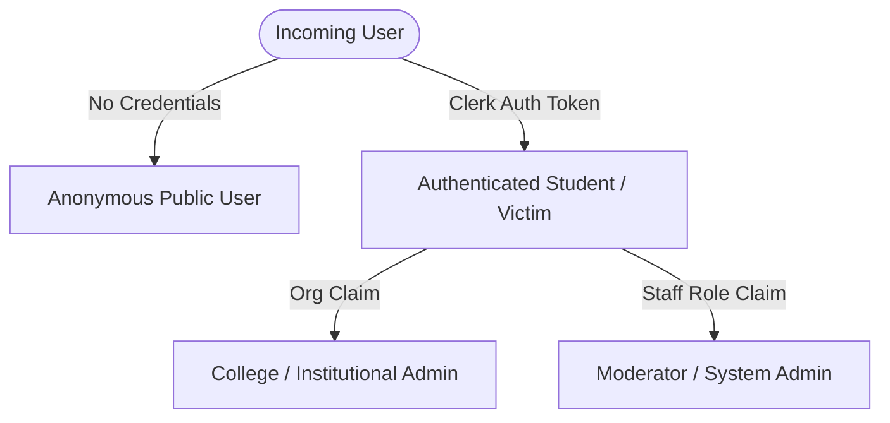

# Scamfy — User Roles & Access Control Matrix

## 1. Role Architecture Overview

Scamfy implements a strict least-privilege Role-Based Access Control (RBAC) model managed via Clerk authentication and verified server-side on the FastAPI backend.

---

## 2. Detailed Permission Matrix

| Feature / Resource | Anonymous User | Authenticated User | College Org Admin | Moderator / Admin |
| :--- | :---: | :---: | :---: | :---: |
| **Basic Scam Text Check** | ✅ Full Access | ✅ Full Access | ✅ Full Access | ✅ Full Access |
| **Emergency 1930 / Official Guide**| ✅ Full Access | ✅ Full Access | ✅ Full Access | ✅ Full Access |
| **Public Pattern Search** | ✅ Anonymized View | ✅ Anonymized View | ✅ Aggregate View | ✅ Full Access |
| **Submit Community Indicator** | ❌ Blocked | ✅ Create Only | ✅ Create Only | ✅ Create & Verify |
| **Create Victim Incident Case** | ❌ Blocked | ✅ Create & Manage Own | ❌ Blocked | ✅ Read (Assigned/Audit) |
| **Upload Private Case Evidence** | ❌ Blocked | ✅ Upload Own | ❌ Blocked | ❌ Blocked (Private) |
| **Generate Incident Export/Summary**| ❌ Blocked | ✅ Export Own | ❌ Blocked | ✅ Auditable Access |
| **Moderate Community Reports** | ❌ Blocked | ❌ Blocked | ❌ Blocked | ✅ Full (Merge/Hide/Approve) |
| **View Audit Logs (`audit_events`)**| ❌ Blocked | ❌ Blocked | ❌ Blocked | ✅ Read Only |
| **Manage Official Routes & Rules** | ❌ Blocked | ❌ Blocked | ❌ Blocked | ✅ Full CRUD |

---

## 3. Role Invariants & Privacy Fences

1. **Zero-Friction Anonymous Scam Check (`SEC-01`)**:
   - A student encountering an urgent suspicious message can paste and analyze it immediately without mandatory signup or email verification.
2. **Private Evidence Isolation (`SEC-07`, `CASE-06`)**:
   - Evidence uploaded to a victim's case is bound to `user_id`. Even moderators cannot view private victim files unless the user explicitly grants temporary sharing/support authorization.
3. **Public Anonymity (`SEC-04`)**:
   - When an authenticated user reports a community indicator (e.g., a fraudulent Telegram handle or UPI ID), the public database records only the pattern metadata. The reporter's identity and personal financial accounts are never exposed.
4. **Immutable Auditability (`SEC-06`)**:
   - Any state change performed by a Moderator (approving a report, merging duplicates, suppressing malicious submissions) creates an append-only `audit_event` record containing operator ID, timestamp, and rationale.
